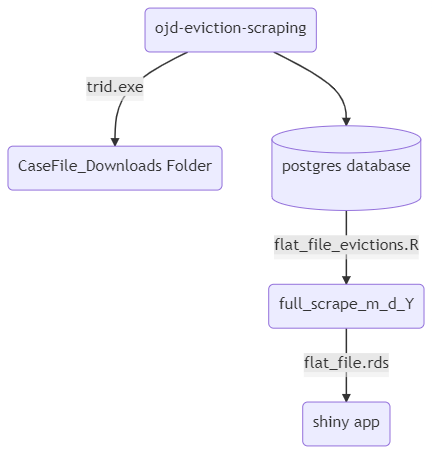

1. Manual scrape operation
	1. Get a Python IDE - I suggest [Pycharm](https://www.jetbrains.com/pycharm/).
	2. Open ojd-eviction-scraping project in Pycharm.
	3. The scraper is run separately for each year 2020 and 2021.
	4. In the settings file, make sure the postgres database is set to ojdevictions_2020 (see below).  The scraper output will be transferred to two individual postgres databases for each year 2020 and 2021 - these will be consolidated in the data cleaning step.     
	```
	DATABASE = {  
	'drivername': 'postgres',  
	'host': 'localhost',  
	'port': '5432',  
	'username': 'postgres',   
	'password': 'admin',   
	'database': 'ojdevictions_2020' }
	``` 
	5. Also in settings, set FILES_STORE to whatever directory you want to store downloaded documents - make sure to reset this location separately for each year.  In this case the files will be stored in the following directory within the project directory.
	```
	FILES_STORE = r'CaseFile_Downloads\2020'
	```
	6. Run the scraper from the top of the project directory with the following command:
	`scrapy crawl ojd-evictions-2020`
	7. If you get an error, check the working directory and try changing it with the cd command.
	8. When the scraper is finished, change the database name to ojdevictions_2021 and set FILES_STORE = r'CaseFile_Downloads\2021' before running the second spider.  (see settings below)
	```
	DATABASE = {  
	'drivername': 'postgres',  
	'host': 'localhost',  
	'port': '5432',  
	'username': 'postgres',   
	'password': 'admin',   
	'database': 'ojdevictions_2021' }

	FILES_STORE = r'CaseFile_Downloads\2021'
	```
9. Run the scraper again for 2021 using the following command: 
`scrapy crawl ojd-evictions-2021`
10. All data should now be populated in postgres.  Open pgAdmin to veiw the postgres tables.  These tables can be found by navigating to Servers/PostgreSQL/Databases /ojdevictions_2020 (or ojdevictions_2021)/Schemas/Tables; you should see 6 tables, case-overviews, case-parties, etc.
11. Note that if you do not want to download court documents from the scrape, turn off the FilesPipeline on line 84 of the settings.py file by preceding it with a #. 
12. Next, process the data and create a flat_file for the project using the r script in the R_dataCleaning directory of the project.  You will only need to run flat_file_evictions.R - but keep the other file (data_cleaning_evictions.R) it contains essential functions.
13. Run flat_file_evictions.R either in RStudio or in the command line by finding the path for Rscript.exe and path to flat_file_evictions.R.  Something like this, depending on your local paths to R and the project:
```
C:\User> "C:\\Program Files\\R\\R-4.0.5\\bin\\Rscript.exe" "C:\\Project\\ojd-eviction-scraping\\R_dataCleaning\\flat_file_evictions.R"  
```
13. flat_file_evictions.R will create a folder in the same directory as the file called full_scrape_m_d_Y (m_d_Y will be populated by the date).  In this new folder you will find all the tables including the flat_file which will be sent to the R Shiny Web App.

